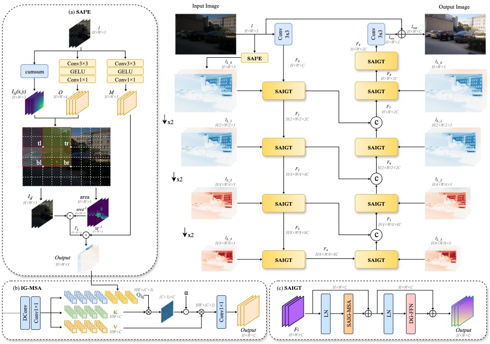

# SAIGFormer: A Spatially-Adaptive Illumination-Guided Network for Low-Light Image Enhancement

## Framework


## Abstract
Recent Transformer-based low-light enhancement methods have made promising progress in recovering global illumination. However, they still struggle with non-uniform lighting scenarios, such as backlit and shadow, appearing as over-exposure or inadequate brightness restoration. To address this challenge, we present a Spatially-Adaptive Illumination-Guided Transformer (SAIGFormer) framework that enables accurate illumination restoration. Specifically, we propose a dynamic integral image representation to model the spatially-varying illumination, and further construct a novel Spatially-Adaptive Integral Illumination Estimator (SAI²E). Moreover, we introduce an Illumination-Guided Multi-head Self-Attention (IG-MSA) mechanism, which leverages the illumination to calibrate the lightness-relevant features toward visual-pleased illumination enhancement. Extensive experiments on five standard low-light datasets and a cross-domain benchmark (LOL-Blur) demonstrate that our SAIGFormer significantly outperforms state-of-the-art methods in both quantitative and qualitative metrics. In particular, our method achieves superior performance in non-uniform illumination enhancement while exhibiting strong generalization capabilities across multiple datasets.

## Environment Setup
```bash
conda create --name saigformer python=3.10
conda activate saigformer
pip install torch==2.6.0 torchvision==0.21.0 --index-url https://download.pytorch.org/whl/cu118
pip install matplotlib scikit-learn scikit-image opencv-python natsort h5py tqdm tensorboard 
pip install torchmetrics thop lmdb numpy pyyaml requests scipy yapf typing triton lpips einops
python setup.py develop --no_cuda_ext
```

## Testing
```bash
# LOL_v1
python Enhancement/test_from_dataset.py --opt Options/SAIGFormer_lolv1.yml --weights pretrained_weights/lolv1_pretrained_weight.pth --dataset LOL_v1

# LOL_v2_real
python3 Enhancement/test_from_dataset.py --opt Options/SAIGFormer_lolv2_real.yml --weights pretrained_weights/lolv2_real_pretrained_weight.pth --dataset LOL_v2_real

# LOL_v2_syn
python3 Enhancement/test_from_dataset.py --opt Options/SAIGFormer_lolv2_syn.yml --weights pretrained_weights/lolv2_syn_pretrained_weight.pth --dataset LOL_v2_syn

# SID
python3 Enhancement/test_from_dataset.py --opt Options/SAIGFormer_SID.yml --weights pretrained_weights/sid_pretrained_weight.pth --dataset SID

# SMID
python3 Enhancement/test_from_dataset.py --opt Options/SAIGFormer_SMID.yml --weights pretrained_weights/smid_pretrained_weight.pth --dataset SMID

# LOL_Blur
python3 Enhancement/test_from_dataset.py --opt Options/SAIGFormer_lol_blur.yml --weights pretrained_weights/lol_blur_pretrained_weight.pth --dataset LOL_Blur
```

## Acknowledgments
Thanks to the [Retinexformer](https://github.com/caiyuanhao1998/Retinexformer.git) repository.